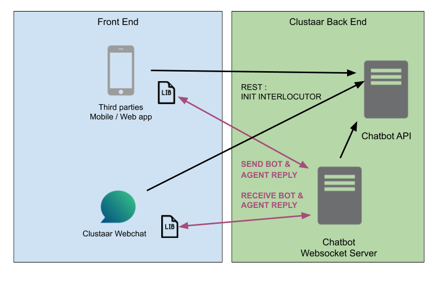

# Clustaar Websocket Sdk

Clustaar Websocket SDK is a Javascript library to simply the implementation of websocket communication between your application and Clustaar API.

## Schema

## Build

npm install
npm build clustaar-webchat-sdk

